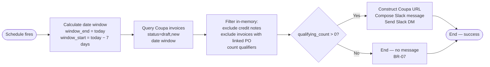

# Solution Design Document — NoPoInvoiceChaser

## Document History

| Date | Version | Author | Role | Comments |
|---|---|---|---|---|
| 2026-09-21 | 1.0 | uipath-architect | Architect | Initial SDD generated from PDD JACTIV-707 |

<!-- DO NOT RENAME: uipath-planner detects SDDs via this exact heading or the marker below. -->
<!-- planner-handoff:v1 -->
## Planner Handoff

| Field | Value |
|---|---|
| **Status** | ready |
| **Execution autonomy** | autonomous |
| **Delivery model** | cloud |
| **SDD scope** | single-product |
| **Project list section** | §7 Project Structure |
| **Tasks file** | `no-po-invoice-chaser-tasks.md` |
| **Generated by** | uipath-planner |
| **Generation date** | 2026-09-21 |
| **Template validation** | passed |

---

## 1. API Workflow Overview

| Field | Value |
|---|---|
| **API Workflow name** | NoPoInvoiceChaser |
| **Objective** | Weekday headless control that queries Coupa for invoices missing a properly linked PO (status draft or new, within the past 7 days), counts qualifying records, and sends one Slack DM to the AP SME; sends nothing on a clean day |
| **Primary use case** | Integration — system-to-system: Coupa read → in-memory filter → Slack write |
| **Invocation pattern** | Scheduled trigger (Orchestrator weekday schedule, 10:00 Europe/Bucharest) |
| **Expected latency** | < 30 seconds per run (single Coupa page + single Slack call) |
| **Expected throughput** | 1 invocation per weekday |
| **Source PDD** | `docs/pdd-jactiv-707-no-po-invoice-chaser.md` |

### In Scope

- Weekday execution triggered at 10:00 Romania time (Europe/Bucharest) via Orchestrator schedule
- Querying the Coupa invoice API for invoices with status `draft` or `new` dated within the past 7 calendar days
- Excluding credit notes from the qualifying population (BR-03)
- Excluding invoices where at least one invoice line carries a properly linked PO reference (BR-01, BR-02)
- Counting the remaining qualifying invoices
- Composing and sending one Slack DM to `irina.capatina@uipath.com` containing the qualifying count, a no-PO-no-pay policy sentence, an action request, and a filtered Coupa URL (BR-05, BR-06)
- Suppressing the message on a clean day — qualifying count = 0 (BR-07; default applied per OQ-01 — see §6)

### Assumptions

- The Coupa IS connection `coupa-uipath-test` (id: `5fadfc73-a372-46ae-a27c-2481741eed07`) is provisioned in Orchestrator folder `Fusion2026` and authenticated; ping state "Failed" is not runtime state — actual API calls return HTTP 200 (org architectural considerations §4)
- The Slack IS connection `slack-product-test-app` (id: `43d506f7-7de2-4798-aac1-9522e2e45dbb`) is provisioned in `Fusion2026` and enabled (org architectural considerations §4)
- `coupa-uipath-test` returns invoices via `GET https://uipath-test.coupahost.com/api/invoices` with `status[in]=draft,new`; the `is-credit-note` flag and `invoice-lines[].po-number` / `order-header-num` are present in the response body (org architectural considerations §4, live-run verification 2026-09-21)
- Date query parameters use `YYYY-MM-DD` format; `invoice-date[gt_or_eq]` and `invoice-date[lt_or_eq]` are the correct field names (org architectural considerations §4)
- Pagination: single-page response assumed given observed sample volume of 194; developer must verify Coupa page-size limit and add iteration if needed [ARCHITECT REVIEW] — OQ-11
- The Slack API `chat.postMessage` endpoint accepts a `channel` field containing the user's email address or user ID; the Slack connection `slack-product-test-app` has the `chat:write` scope [ARCHITECT REVIEW] — developer must confirm correct channel identifier at build time

---

## 2. Input Schema

This workflow is invoked by an Orchestrator schedule with no caller-supplied input parameters. All inputs are derived at runtime.

| Field | Type | Required | Description | Example |
|---|---|---|---|---|
| *(none)* | — | — | Workflow is schedule-triggered; all values computed internally | — |

### Sample Input

```json
{}
```

---

## 3. Output Schema

The workflow produces no structured output to a caller. It terminates with Orchestrator job status `Successful` or `Faulted`.

| Field | Type | Always Present | Description | Example |
|---|---|---|---|---|
| *(none — schedule trigger, no caller)* | — | — | Run outcome is Orchestrator job status | — |

### Sample Output

```json
{}
```

---

## 4. Execution Flow



### Step Details

| # | Step | Activity Type | Input | Output | Notes |
|---|---|---|---|---|---|
| 1 | Calculate date window | Script (inline expression) | Run date (system `$now`) | `windowStart` (YYYY-MM-DD), `windowEnd` (YYYY-MM-DD) | BR-04; `windowStart = today − 7 calendar days`; `windowEnd = today` |
| 2 | Query Coupa invoices | HTTP Request (connector: `coupa-uipath-test`) | `windowStart`, `windowEnd` | `invoices[]` array from `response.content` | `GET /api/invoices` with `status[in]=draft,new`, `invoice-date[gt_or_eq]`, `invoice-date[lt_or_eq]`, `limit=50` [ARCHITECT REVIEW] — OQ-11: developer must verify page size and add pagination loop if total > page limit |
| 3 | Filter and count | For Each + Script (inline) | `invoices[]` | `qualifying_count` (integer), filtered list for logging | Exclude where `is-credit-note = true` (BR-03); exclude where any `invoice-lines[].po-number` or `invoice-lines[].order-header-num` is non-empty and is a proper PO linkage (BR-01, BR-02; confirm field name at build time — OQ-12); log exclusion reason `"credit note"` for B1 records; description-only PO does not satisfy linkage check (BR-02) |
| 4 | Clean-day branch | If | `qualifying_count` | — | If `qualifying_count = 0` → end run with success (BR-07). [ARCHITECT REVIEW] OQ-01: section 7.1 of the PDD contradicts BR-07 and says send a congratulations message; default is BR-07 (no message). |
| 5 | Construct Coupa URL | Script (inline expression) | `windowStart`, `windowEnd` | `coupaFilteredUrl` string | Pattern verbatim from PDD §11: `https://uipath-test.coupahost.com/invoices?q%5Binvoice_date_gteq%5D={windowStart}&q%5Binvoice_date_lteq%5D={windowEnd}&q%5Bstatus_eq%5D=draft`. [ARCHITECT REVIEW] OQ-03: URL filters to `draft` only; SME to confirm whether combined `draft+new` filter is needed. |
| 6 | Compose Slack message | Script (inline expression) | `qualifying_count`, `coupaFilteredUrl` | `slackMessageBody` string | Template (BR-05, BR-06): `"{qualifying_count} invoices from the last seven days have no purchase order linked. An invoice without a linked PO cannot be matched or paid under our no-PO-no-pay policy, and payment to the supplier stalls until it is fixed. Please make sure a purchase order exists for these invoices and is correctly linked to each one. Open the list in Coupa: {coupaFilteredUrl}"` |
| 7 | Send Slack DM | HTTP Request (connector: `slack-product-test-app`) | `slackMessageBody`, recipient `irina.capatina@uipath.com` | HTTP response (status, ok) | `POST https://slack.com/api/chat.postMessage`; body: `{ channel: "irina.capatina@uipath.com", text: slackMessageBody }`. BR-06: single recipient; individual invoices are NOT listed (BR-05) |

---

## 5. Connectors & External Calls

### Integration Service Connectors

| Connector key | Connection name | Connection ID | Operation | Called in step | Endpoint | Parameters |
|---|---|---|---|---|---|---|
| `uipath-coupa-coupa` | `coupa-uipath-test` | `5fadfc73-a372-46ae-a27c-2481741eed07` | HTTP Request (`authentication: connector`) | Step 2 | `GET https://uipath-test.coupahost.com/api/invoices` | `status[in]=draft,new`, `invoice-date[gt_or_eq]={windowStart}`, `invoice-date[lt_or_eq]={windowEnd}`, `order_by=invoice-date`, `dir=desc`, `limit=50` |
| `uipath-salesforce-slack` | `slack-product-test-app` | `43d506f7-7de2-4798-aac1-9522e2e45dbb` | HTTP Request (`authentication: connector`) | Step 7 | `POST https://slack.com/api/chat.postMessage` | `body: { channel: "irina.capatina@uipath.com", text: slackMessageBody }` |

### Direct HTTP Calls

None. Both integrations use existing IS connections via the HTTP Request activity with `authentication: connector` (org architectural considerations §4).

### Integration Service Connections

| Connection name | System | Connector key | Connection ID | Access method | Folder | Used by steps |
|---|---|---|---|---|---|---|
| `coupa-uipath-test` | Coupa | `uipath-coupa-coupa` | `5fadfc73-a372-46ae-a27c-2481741eed07` | Integration Service — existing program infrastructure | `Fusion2026` | Step 2 |
| `slack-product-test-app` | Slack | `uipath-salesforce-slack` | `43d506f7-7de2-4798-aac1-9522e2e45dbb` | Integration Service — existing program infrastructure | `Fusion2026` | Step 7 |

Both connections already exist in `Fusion2026` as shared program infrastructure (org architectural considerations §4). They must not be recreated or renamed. They are deployment prerequisites that must be verified as authorised before the first production run.

Activity shape, `bindings_v2.json` entry and connection-resource file: `docs/architectural-considerations.md` §4, verbatim.

---

## 6. Error Handling

Per BR-08 and BR-09 (text is authoritative over the future-state diagram; see OQ-02), no retry and no error notification are required. A run that cannot complete is reported as a failed run in Orchestrator only. [ARCHITECT REVIEW] OQ-02: the future-state diagram shows retry up to 3 attempts and an error Slack message; if the diagram is authoritative, retry counts and error message content must be defined before build.

### Known Error Scenarios

| Error ID | Failure | Detection | Response | Who is told |
|---|---|---|---|---|
| S1 | Coupa query failure — error response, timeout, or unparseable payload | `response.statusCode` not 2xx, or JSON parse exception | Log failure (error type, status code); throw to terminate run; Orchestrator marks job Faulted | Orchestrator job log; no Slack notification (BR-09) |
| S2 | Slack delivery failure — API error or undeliverable | `response.statusCode` not 2xx | Log failure (status code, response); throw to terminate run; Orchestrator marks job Faulted | Orchestrator job log; no secondary notification (BR-09) |
| S3 | Application unreachable — connection cannot be established | Exception from HTTP Request activity | Log failure; throw; run Faulted | Orchestrator job log |
| S4 | Credential expiry — IS connection rejected during auth | Exception from HTTP Request activity | Log failure with connection name (never the credential value); throw; run Faulted | Orchestrator job log |
| S5 | Unhandled runtime exception | Any uncaught exception | Log full exception details; throw; run Faulted | Orchestrator job log |

### Retry Policy

No retry specified — BR-08 (text) states no retry behaviour is required. The platform's `httpRetryConfig` at workflow level is not applied. If OQ-02 resolves to allow retries, implement using `httpRetryConfig` (not a hand-built retry loop — org architectural considerations §8).

One failure boundary: a single catch at the workflow edge logs the error and terminates the run.

**BR-10 scope enforcement:** the workflow issues no write calls to Coupa at any step. The `coupa-uipath-test` connection is used for a single `GET /api/invoices` call. No purchase orders are created or modified; no Coupa records are changed; no write scope is requested. Post-run Coupa audit log must show no writes from the robot service account.

---

## 7. Project Structure

```text
jactiv-707-no-po-invoice-chaser/           (solution = repository name, verbatim — org architectural considerations §4)
└── NoPoInvoiceChaser/                     (API Workflow project)
    ├── Workflow.json                      (workflow definition — document.dsl)
    ├── entry-points.json                  (CLI-managed; one entry point for the scheduled trigger)
    └── bindings_v2.json                   (one binding entry per HTTP Request activity)
```

### Deployment Target

Published to Orchestrator folder `Fusion2026` (org architectural considerations §1, modern folders). Invoked by Orchestrator weekday schedule at 10:00 Europe/Bucharest.

### Solution / Project Breakdown

| Project | Product | Repository | Orchestrator folder | Attended / Unattended |
|---|---|---|---|---|
| NoPoInvoiceChaser | API Workflow | `jactiv-707-no-po-invoice-chaser` | `Fusion2026` | N/A — serverless runtime, no robot |

### Reusable Components

| Type | Name | Details |
|---|---|---|
| reused | `coupa-uipath-test` IS connection | Program-shared infrastructure in `Fusion2026`; not created by this build |
| reused | `slack-product-test-app` IS connection | Program-shared infrastructure in `Fusion2026`; not created by this build |

### Environments (DEV / UAT / PROD)

| Item | DEV | UAT | PROD | Used by |
|---|---|---|---|---|
| Orchestrator + Tenant | Automation Cloud EU (standard) — org GitHub variable `UIPATH_ORGANIZATION` / `UIPATH_TENANT` | same tenant | same tenant | All |
| Folder | `Fusion2026` [ARCHITECT REVIEW] — confirm per-environment subfolder naming with deployment team | `Fusion2026` [ARCHITECT REVIEW] | `Fusion2026` [ARCHITECT REVIEW] | All |
| Coupa base URL | `https://uipath-test.coupahost.com/api/` (test tenant) | [ARCHITECT REVIEW] OQ-05 — production URL unconfirmed | [ARCHITECT REVIEW] OQ-05 | NoPoInvoiceChaser |
| Slack recipient | `irina.capatina@uipath.com` (BR-06, hardcoded) | same | same | NoPoInvoiceChaser |
| Schedule | Weekday 10:00 Europe/Bucharest (PDD §3, BR-04) | same | same | NoPoInvoiceChaser |

---

## 8. Testing Strategy

### Happy Path

| Test ID | Scenario | Setup | Expected result |
|---|---|---|---|
| T-01 | Qualifying invoices present | Coupa returns ≥ 1 invoice: status `draft` or `new`, within 7-day window, not a credit note, no linked PO | Slack DM delivered to `irina.capatina@uipath.com`; message body contains qualifying count, policy sentence, action request, and Coupa URL with correct date window; job status = Successful |
| T-02 | Clean day — no qualifying invoices | Coupa returns records that all pass credit-note or PO-linkage exclusion, leaving count = 0 | No Slack message sent; job status = Successful |
| T-03 | Mixed records — credit notes and PO-linked excluded | Coupa returns mix: 1 credit note, 1 properly PO-linked, 1 qualifying | Slack DM sent with count = 1; excluded records absent from message count |
| T-04 | Description-only PO treated as missing | Invoice has PO number in description field only, no `po-number` / `order-header-num` on invoice lines | Invoice counted as qualifying (BR-02) |
| T-05 | Date window accuracy | Run on a known date; verify Coupa query params | `invoice-date[gt_or_eq]` = run-date − 7 days; `invoice-date[lt_or_eq]` = run-date (YYYY-MM-DD) |

### Business Exception Tests

| Test ID | Scenario | Expected result |
|---|---|---|
| T-B1 | Credit note in Coupa response | Record excluded; exclusion reason logged as `"credit note"`; qualifying count unaffected |
| T-B2 | Invoice has description-only PO reference | Counted as missing PO; included in qualifying set |
| T-B3 | All returned invoices are credit notes | qualifying_count = 0; no Slack DM sent; job Successful |

### System Error Tests

| Test ID | Scenario | Expected result |
|---|---|---|
| T-S1 | Coupa returns HTTP 500 | Job Faulted; error logged with status code; no Slack DM sent |
| T-S2 | Slack returns HTTP 500 | Job Faulted; error logged with status code |
| T-S3 | IS connection `coupa-uipath-test` auth failure | Job Faulted; connection name logged (not credential value) |
| T-S4 | IS connection `slack-product-test-app` auth failure | Job Faulted; connection name logged |
| T-S5 | Unhandled runtime exception | Job Faulted; full exception details in Orchestrator log |

---

## 9. Next Steps

This SDD captures architecture and decisions. To generate the implementation task list and execute the build, load `uipath-planner` with this SDD path:

> Load `uipath-planner`. SDD path: `docs/sdd-jactiv-707-no-po-invoice-chaser.md`.

The planner derives the per-skill task list (routing each task to `uipath-api-workflow`, `uipath-platform`, etc.), writes `no-po-invoice-chaser-tasks.md`, and emits live tasks. After the task list is executed, package and deploy via `uipath-solution`: `uip solution init` → `project add` → `resources refresh` → `pack`.

**Open architect-review items (non-blocking) to resolve before production sign-off:**

- OQ-01 — Clean-day behaviour: BR-07 (no message) is the applied default; SME must confirm
- OQ-02 — Retry / error notification: no-retry is the applied default; SME must confirm
- OQ-03 — Coupa URL status filter: `draft`-only is the applied default; SME to confirm `draft+new`
- OQ-05 — Coupa production URL: test tenant URL applied; SME to provide production URL
- OQ-11 — Coupa pagination: developer must verify page size limit and add pagination if needed
- OQ-12 — PO-linkage field name: `po-number` / `order-header-num` on `invoice-lines[]` per org §4 live-run; developer must confirm against Coupa API schema at build time

---

**End of Solution Design Document.**
